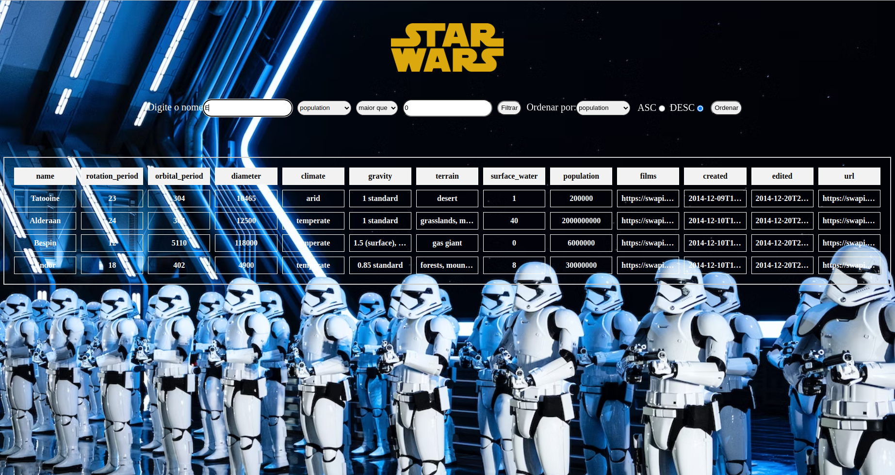

# Star Wars Planet Search

Neste projeto, desenvolvi uma aplicação web que faz uma requisição para a API de Star Wars e preenche uma tabela com os dados dos planetas retornados. Além disso, criei filtros de texto e valores numéricos para a tabela, permitindo que o usuário possa pesquisar e filtrar os dados de acordo com sua necessidade. Também implementei múltiplos filtros numéricos, para que o usuário possa aplicar diferentes filtros simultaneamente. Para garantir a qualidade do projeto, desenvolvi testes automatizados que cobrem 30% e 60% da aplicação. E por fim, ordenei as colunas da tabela de forma ascendente ou descendente, para que o usuário possa visualizar os dados da maneira que desejar. E tudo isso usando Context API e Hooks para controlar os estados globais! :smile:

<details>
<summary> Aprendizados </summary>

- Utilizei a Context API do React para gerenciar estado;
- Utilizei o React Hook useState;
- Utilizei o React Hook useContext;
- Utilizei o React Hook useEffect;
- Criei React Hooks customizados;
- Escrevi testes para garantir que sua aplicação possua uma boa cobertura de testes.

</details>

## Rodando localmente

Clone o projeto

```bash
  git clone git@github.com:MarcoViana0303/project-starwars-planets-search.git
```

Entre no diretório do projeto

```bash
  cd project-starwars-planets-search
```

Instale as dependências

```bash
  npm install
```

Inicie o servidor

```bash
  npm run start
```


## Documentação

[Saiba mais sobre Context API](https://legacy.reactjs.org/docs/context.html)


## Screenshots




## Feedback

Possui alguma dúvida ou encontrou um erro no código? Não deixe de entrar em contato comigo!


## 🔗 Links
[](https://marcoviana-dev.vercel.app/)
[](https://www.linkedin.com/in/marco-viana2022/)
